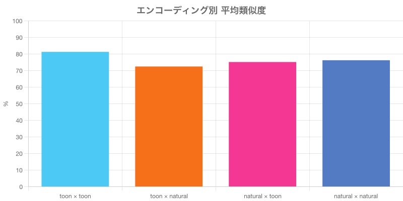
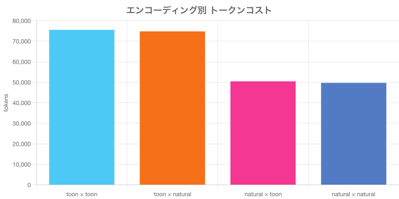

# エンコーディング比較レポート

対象人物: **森田大地**
モデル: text-embedding-3-small
生成日: 2026-03-23

## チャート

## toon × toon

- インデックス方式: **toon**
- 検索クエリ方式: **toon**
- インデックス時トークン: 72,855
- 検索クエリトークン: 2,694
- 合計トークン: 75,549
- 検索テキスト長: 2,694 文字

| 順位 | 名前 | 類似度 |
|------|------|--------|
| 1 | 岡田悠人 | 95.34% |
| 2 | パテルアルジュン | 78.48% |
| 3 | 鈴木健一 | 78.11% |
| 4 | 田中理恵 | 77.88% |
| 5 | 安藤海斗 | 76.84% |

## toon × natural

- インデックス方式: **toon**
- 検索クエリ方式: **natural**
- インデックス時トークン: 72,855
- 検索クエリトークン: 1,931
- 合計トークン: 74,786
- 検索テキスト長: 1,931 文字

| 順位 | 名前 | 類似度 |
|------|------|--------|
| 1 | 岡田悠人 | 87.33% |
| 2 | 鈴木健一 | 69.62% |
| 3 | パテルアルジュン | 69.40% |
| 4 | 高橋陽太 | 68.49% |
| 5 | 大野俊介 | 67.72% |

## natural × toon

- インデックス方式: **natural**
- 検索クエリ方式: **toon**
- インデックス時トークン: 47,768
- 検索クエリトークン: 2,694
- 合計トークン: 50,462
- 検索テキスト長: 2,694 文字

| 順位 | 名前 | 類似度 |
|------|------|--------|
| 1 | 岡田悠人 | 87.25% |
| 2 | 川口萌 | 72.80% |
| 3 | 高橋陽太 | 72.49% |
| 4 | 安藤海斗 | 71.75% |
| 5 | 田中理恵 | 71.73% |

## natural × natural

- インデックス方式: **natural**
- 検索クエリ方式: **natural**
- インデックス時トークン: 47,768
- 検索クエリトークン: 1,931
- 合計トークン: 49,699
- 検索テキスト長: 1,931 文字

| 順位 | 名前 | 類似度 |
|------|------|--------|
| 1 | 岡田悠人 | 92.81% |
| 2 | 高橋陽太 | 75.14% |
| 3 | 安藤海斗 | 73.01% |
| 4 | 川口萌 | 70.31% |
| 5 | 鈴木健一 | 70.14% |

## サマリー

| 組み合わせ | インデックストークン | 検索トークン | 合計トークン | 平均類似度 | 最高類似度 |
|------------|---------------------|-------------|-------------|-----------|-----------|
| toon × toon | 72,855 | 2,694 | 75,549 | 81.33% | 95.34% |
| toon × natural | 72,855 | 1,931 | 74,786 | 72.51% | 87.33% |
| natural × toon | 47,768 | 2,694 | 50,462 | 75.20% | 87.25% |
| natural × natural | 47,768 | 1,931 | 49,699 | 76.28% | 92.81% |

### 結果の比較

| 名前 | toon×toon | toon×natural | natural×toon | natural×natural |
|------|------|------|------|------|
| 岡田悠人 | #1 (95.3%) | #1 (87.3%) | #1 (87.3%) | #1 (92.8%) |
| パテルアルジュン | #2 (78.5%) | #3 (69.4%) | - | - |
| 鈴木健一 | #3 (78.1%) | #2 (69.6%) | - | #5 (70.1%) |
| 田中理恵 | #4 (77.9%) | - | #5 (71.7%) | - |
| 安藤海斗 | #5 (76.8%) | - | #4 (71.8%) | #3 (73.0%) |
| 高橋陽太 | - | #4 (68.5%) | #3 (72.5%) | #2 (75.1%) |
| 大野俊介 | - | #5 (67.7%) | - | - |
| 川口萌 | - | - | #2 (72.8%) | #4 (70.3%) |

### 推奨

- **最高精度**: toon × toon
- **最低コスト**: natural × natural (49,699 tokens)
