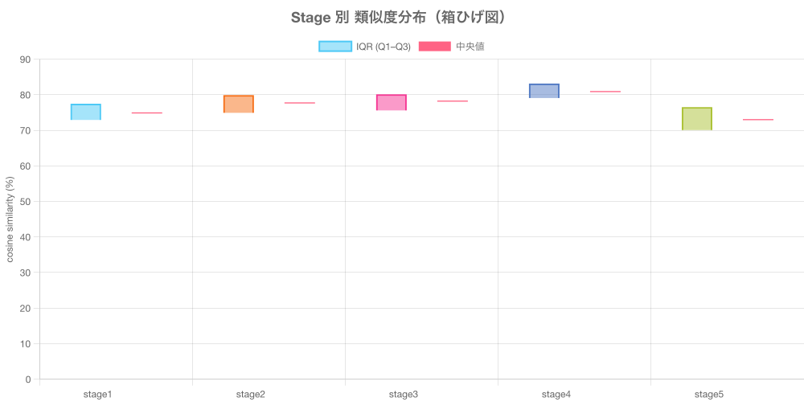
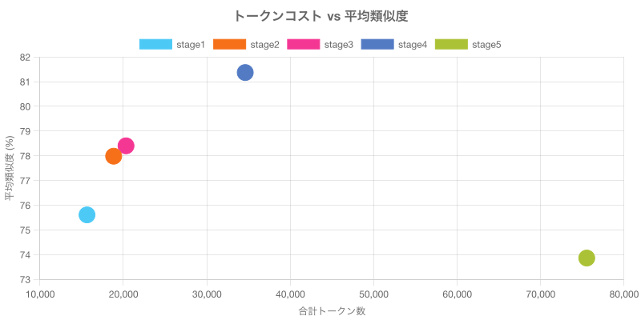
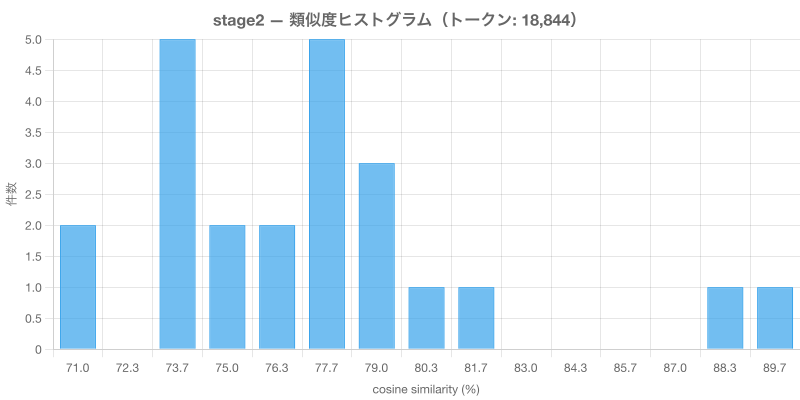
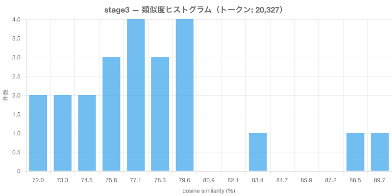
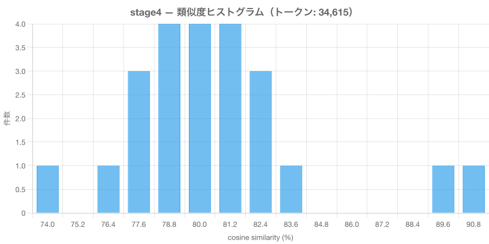
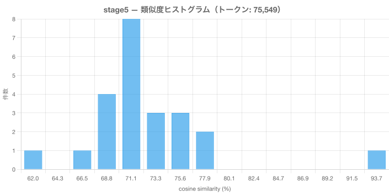

# TOON 形式 Stage 別 類似度分布レポート

対象人物: **森田大地**
エンコーディング: **toon × toon**
モデル: text-embedding-3-small
検索件数: 23
生成日: 2026-03-27

## 全体比較（箱ひげ図）

## トークンコスト vs 平均類似度

---

## stage1

含める属性: **name, type**

### テキストデータ

- インデックス用: [embed_stage1.txt](./data/embed_stage1.txt)
- 検索クエリ用: [search_stage1.txt](./data/search_stage1.txt)

### トークンコスト

| 項目 | 値 |
|------|-----|
| インデックス時トークン | 15,249 |
| 検索クエリトークン | 403 |
| 合計トークン | 15,652 |

### 分布統計

| 統計量 | 値 |
|--------|-----|
| サンプル数 | 23 |
| 最小値 | 66.77% |
| Q1（第1四分位） | 72.90% |
| 中央値（Q2） | 74.88% |
| Q3（第3四分位） | 77.46% |
| 最大値 | 88.39% |
| 平均 | 75.61% |
| 標準偏差 | 4.79 |
| IQR | 4.57 |
| 外れ値数 | 2 |

### ヒストグラム

---

## stage2

含める属性: **name, type, tags**

### テキストデータ

- インデックス用: [embed_stage2.txt](./data/embed_stage2.txt)
- 検索クエリ用: [search_stage2.txt](./data/search_stage2.txt)

### トークンコスト

| 項目 | 値 |
|------|-----|
| インデックス時トークン | 18,344 |
| 検索クエリトークン | 500 |
| 合計トークン | 18,844 |

### 分布統計

| 統計量 | 値 |
|--------|-----|
| サンプル数 | 23 |
| 最小値 | 71.27% |
| Q1（第1四分位） | 74.91% |
| 中央値（Q2） | 77.70% |
| Q3（第3四分位） | 79.89% |
| 最大値 | 90.01% |
| 平均 | 77.98% |
| 標準偏差 | 4.47 |
| IQR | 4.97 |
| 外れ値数 | 2 |

### ヒストグラム

---

## stage3

含める属性: **name, type, tags, strength**

### テキストデータ

- インデックス用: [embed_stage3.txt](./data/embed_stage3.txt)
- 検索クエリ用: [search_stage3.txt](./data/search_stage3.txt)

### トークンコスト

| 項目 | 値 |
|------|-----|
| インデックス時トークン | 19,782 |
| 検索クエリトークン | 545 |
| 合計トークン | 20,327 |

### 分布統計

| 統計量 | 値 |
|--------|-----|
| サンプル数 | 23 |
| 最小値 | 72.13% |
| Q1（第1四分位） | 75.60% |
| 中央値（Q2） | 78.20% |
| Q3（第3四分位） | 80.11% |
| 最大値 | 90.46% |
| 平均 | 78.40% |
| 標準偏差 | 4.44 |
| IQR | 4.51 |
| 外れ値数 | 2 |

### ヒストグラム

---

## stage4

含める属性: **name, type, tags, strength, dates**

### テキストデータ

- インデックス用: [embed_stage4.txt](./data/embed_stage4.txt)
- 検索クエリ用: [search_stage4.txt](./data/search_stage4.txt)

### トークンコスト

| 項目 | 値 |
|------|-----|
| インデックス時トークン | 33,656 |
| 検索クエリトークン | 959 |
| 合計トークン | 34,615 |

### 分布統計

| 統計量 | 値 |
|--------|-----|
| サンプル数 | 23 |
| 最小値 | 74.86% |
| Q1（第1四分位） | 79.07% |
| 中央値（Q2） | 80.88% |
| Q3（第3四分位） | 83.14% |
| 最大値 | 91.07% |
| 平均 | 81.37% |
| 標準偏差 | 3.64 |
| IQR | 4.07 |
| 外れ値数 | 2 |

### ヒストグラム

---

## stage5

含める属性: **name, type, tags, strength, dates, description**

### テキストデータ

- インデックス用: [embed_stage5.txt](./data/embed_stage5.txt)
- 検索クエリ用: [search_stage5.txt](./data/search_stage5.txt)

### トークンコスト

| 項目 | 値 |
|------|-----|
| インデックス時トークン | 72,855 |
| 検索クエリトークン | 2,694 |
| 合計トークン | 75,549 |

### 分布統計

| 統計量 | 値 |
|--------|-----|
| サンプル数 | 23 |
| 最小値 | 62.85% |
| Q1（第1四分位） | 70.06% |
| 中央値（Q2） | 72.99% |
| Q3（第3四分位） | 76.51% |
| 最大値 | 95.33% |
| 平均 | 73.86% |
| 標準偏差 | 5.76 |
| IQR | 6.45 |
| 外れ値数 | 1 |

### ヒストグラム

---

## サマリー比較

| ステージ | 属性 | 合計トークン | 平均類似度 | 中央値 | 標準偏差 | IQR | 最高 | 最低 |
|----------|------|-------------|-----------|--------|---------|-----|------|------|
| stage1 | name, type | 15,652 | 75.61% | 74.88% | 4.79 | 4.57 | 88.39% | 66.77% |
| stage2 | name, type, tags | 18,844 | 77.98% | 77.70% | 4.47 | 4.97 | 90.01% | 71.27% |
| stage3 | name, type, tags, strength | 20,327 | 78.40% | 78.20% | 4.44 | 4.51 | 90.46% | 72.13% |
| stage4 | name, type, tags, strength, dates | 34,615 | 81.37% | 80.88% | 3.64 | 4.07 | 91.07% | 74.86% |
| stage5 | name, type, tags, strength, dates, description | 75,549 | 73.86% | 72.99% | 5.76 | 6.45 | 95.33% | 62.85% |

## 考察

### 識別力（分布の広がり）

IQR が最も大きいのは **stage5**（IQR: 6.45）。
分布が広いほど、類似・非類似を区別する識別力が高い。

### 上位スコアの明確さ

最高類似度が最も高いのは **stage5**（95.33%）。
最高値と中央値の差が大きいほど、上位マッチが明確に際立っている。

- stage1: 最高 88.39% − 中央値 74.88% = 差 13.51
- stage2: 最高 90.01% − 中央値 77.70% = 差 12.32
- stage3: 最高 90.46% − 中央値 78.20% = 差 12.25
- stage4: 最高 91.07% − 中央値 80.88% = 差 10.19
- stage5: 最高 95.33% − 中央値 72.99% = 差 22.34

### コスト効率

- stage1: 平均類似度 75.61% / 15,652 tokens（効率: 48.3069）
- stage2: 平均類似度 77.98% / 18,844 tokens（効率: 41.3843）
- stage3: 平均類似度 78.40% / 20,327 tokens（効率: 38.5713）
- stage4: 平均類似度 81.37% / 34,615 tokens（効率: 23.5070）
- stage5: 平均類似度 73.86% / 75,549 tokens（効率: 9.7768）
