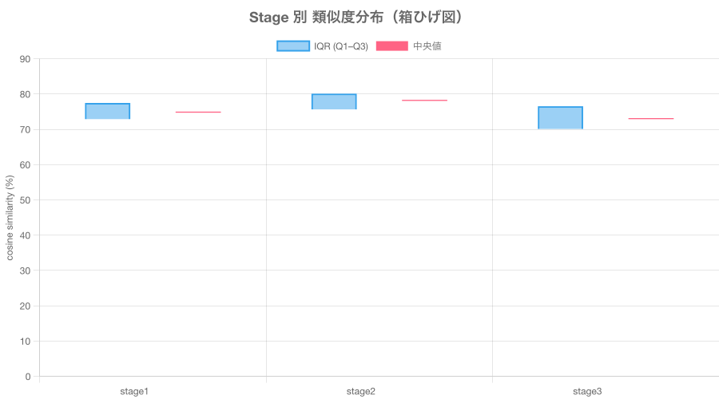
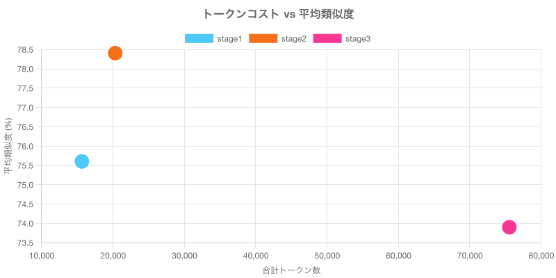
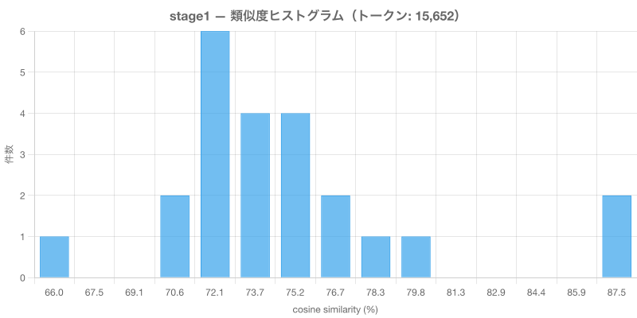
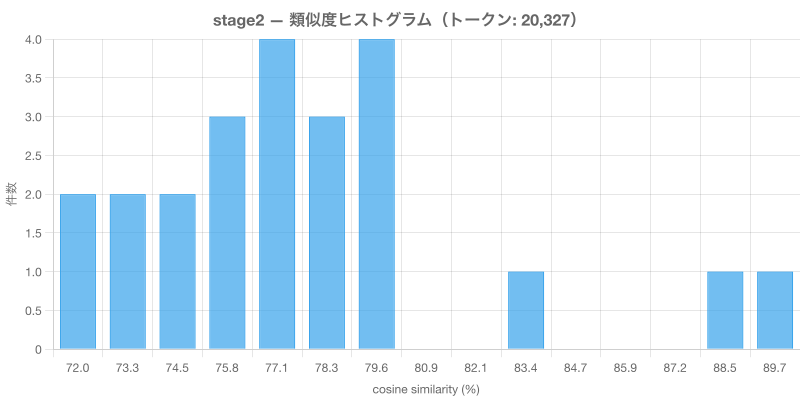
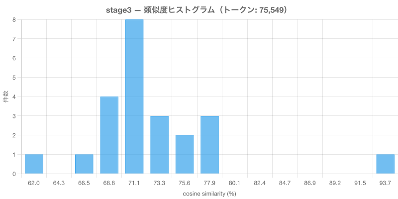

# TOON 形式 Stage 別 類似度分布レポート

対象人物: **森田大地**
エンコーディング: **toon × toon**
モデル: text-embedding-3-small
検索件数: 23
生成日: 2026-03-27

## 全体比較（箱ひげ図）

## トークンコスト vs 平均類似度

---

## stage1

含める属性: **name, type**

### トークンコスト

| 項目 | 値 |
|------|-----|
| インデックス時トークン | 15,249 |
| 検索クエリトークン | 403 |
| 合計トークン | 15,652 |

### 分布統計

| 統計量 | 値 |
|--------|-----|
| サンプル数 | 23 |
| 最小値 | 66.71% |
| Q1（第1四分位） | 72.90% |
| 中央値（Q2） | 74.86% |
| Q3（第3四分位） | 77.46% |
| 最大値 | 88.39% |
| 平均 | 75.60% |
| 標準偏差 | 4.80 |
| IQR | 4.57 |
| 外れ値数 | 2 |

### ヒストグラム

---

## stage2

含める属性: **name, type, tags, strength**

### トークンコスト

| 項目 | 値 |
|------|-----|
| インデックス時トークン | 19,782 |
| 検索クエリトークン | 545 |
| 合計トークン | 20,327 |

### 分布統計

| 統計量 | 値 |
|--------|-----|
| サンプル数 | 23 |
| 最小値 | 72.13% |
| Q1（第1四分位） | 75.65% |
| 中央値（Q2） | 78.20% |
| Q3（第3四分位） | 80.10% |
| 最大値 | 90.46% |
| 平均 | 78.41% |
| 標準偏差 | 4.43 |
| IQR | 4.45 |
| 外れ値数 | 2 |

### ヒストグラム

---

## stage3

含める属性: **name, type, tags, strength, description, dates**

### トークンコスト

| 項目 | 値 |
|------|-----|
| インデックス時トークン | 72,855 |
| 検索クエリトークン | 2,694 |
| 合計トークン | 75,549 |

### 分布統計

| 統計量 | 値 |
|--------|-----|
| サンプル数 | 23 |
| 最小値 | 62.93% |
| Q1（第1四分位） | 70.10% |
| 中央値（Q2） | 73.03% |
| Q3（第3四分位） | 76.54% |
| 最大値 | 95.34% |
| 平均 | 73.90% |
| 標準偏差 | 5.75 |
| IQR | 6.44 |
| 外れ値数 | 1 |

### ヒストグラム

---

## サマリー比較

| ステージ | 属性 | 合計トークン | 平均類似度 | 中央値 | 標準偏差 | IQR | 最高 | 最低 |
|----------|------|-------------|-----------|--------|---------|-----|------|------|
| stage1 | name, type | 15,652 | 75.60% | 74.86% | 4.80 | 4.57 | 88.39% | 66.71% |
| stage2 | name, type, tags, strength | 20,327 | 78.41% | 78.20% | 4.43 | 4.45 | 90.46% | 72.13% |
| stage3 | name, type, tags, strength, description, dates | 75,549 | 73.90% | 73.03% | 5.75 | 6.44 | 95.34% | 62.93% |

## 考察

### 識別力（分布の広がり）

IQR が最も大きいのは **stage3**（IQR: 6.44）。
分布が広いほど、類似・非類似を区別する識別力が高い。

### 上位スコアの明確さ

最高類似度が最も高いのは **stage3**（95.34%）。
最高値と中央値の差が大きいほど、上位マッチが明確に際立っている。

- stage1: 最高 88.39% − 中央値 74.86% = 差 13.52
- stage2: 最高 90.46% − 中央値 78.20% = 差 12.26
- stage3: 最高 95.34% − 中央値 73.03% = 差 22.31

### コスト効率

- stage1: 平均類似度 75.60% / 15,652 tokens（効率: 48.3030）
- stage2: 平均類似度 78.41% / 20,327 tokens（効率: 38.5719）
- stage3: 平均類似度 73.90% / 75,549 tokens（効率: 9.7817）
