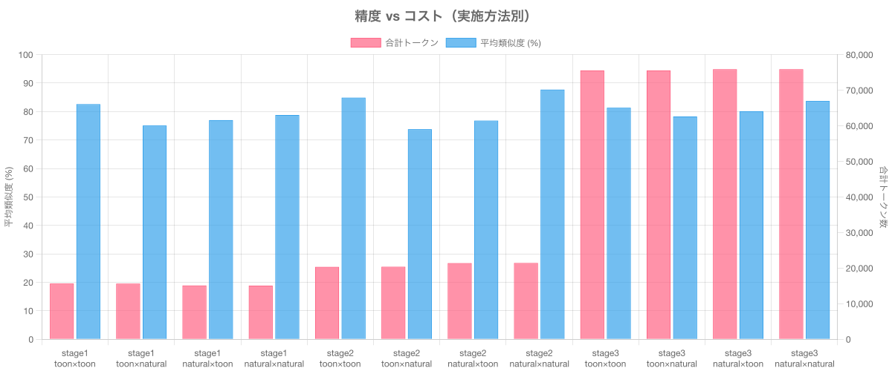
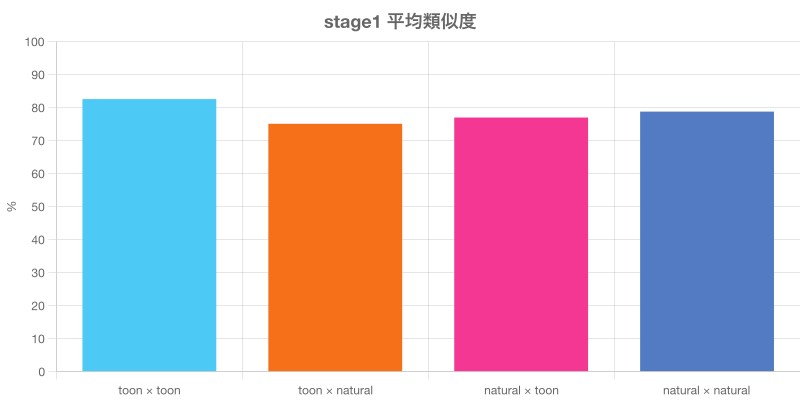
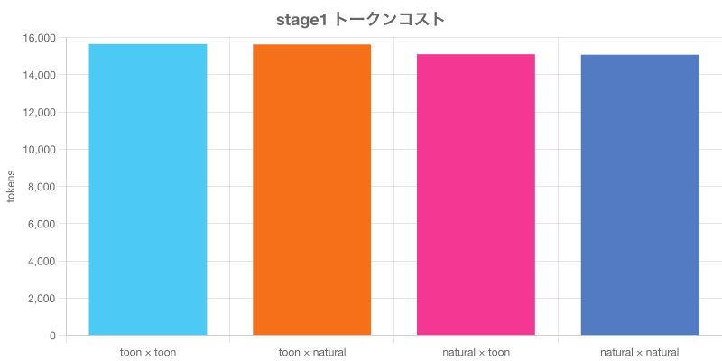
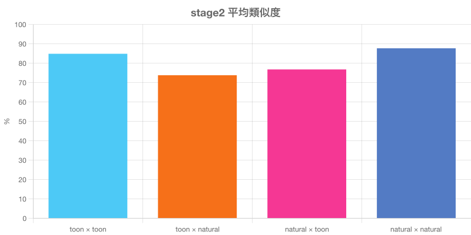
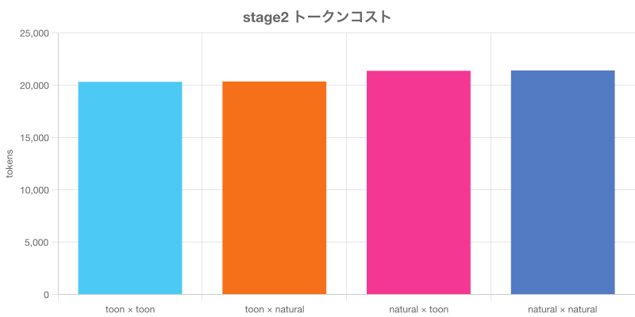
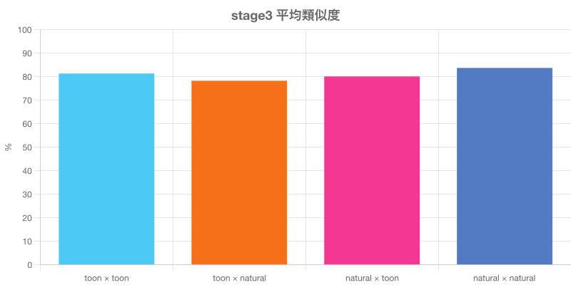
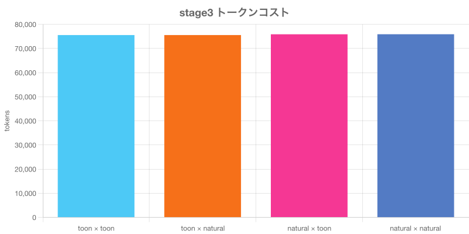

# 段階的エンコーディング比較レポート

対象人物: **森田大地**
モデル: text-embedding-3-small
生成日: 2026-03-23

## 全体比較

---

## stage1

含める属性: **name, type**

### toon × toon

- インデックス時トークン: 15,249
- 検索クエリトークン: 403
- 合計トークン: 15,652
- インデックスデータ: [embed_stage1_toon_toon.txt](./data/embed_stage1_toon_toon.txt)
- 検索クエリデータ: [search_stage1_toon_toon.txt](./data/search_stage1_toon_toon.txt)

| 順位 | 名前 | 類似度 |
|------|------|--------|
| 1 | 高橋陽太 | 88.39% |
| 2 | 岡田悠人 | 87.86% |
| 3 | 安藤海斗 | 80.31% |
| 4 | 佐藤美咲 | 78.70% |
| 5 | 李明浩 | 77.64% |

### toon × natural

- インデックス時トークン: 15,249
- 検索クエリトークン: 380
- 合計トークン: 15,629
- インデックスデータ: [embed_stage1_toon_natural.txt](./data/embed_stage1_toon_natural.txt)
- 検索クエリデータ: [search_stage1_toon_natural.txt](./data/search_stage1_toon_natural.txt)

| 順位 | 名前 | 類似度 |
|------|------|--------|
| 1 | 高橋陽太 | 81.07% |
| 2 | 岡田悠人 | 79.60% |
| 3 | 安藤海斗 | 72.02% |
| 4 | 佐藤美咲 | 71.42% |
| 5 | 李明浩 | 71.38% |

### natural × toon

- インデックス時トークン: 14,697
- 検索クエリトークン: 403
- 合計トークン: 15,100
- インデックスデータ: [embed_stage1_natural_toon.txt](./data/embed_stage1_natural_toon.txt)
- 検索クエリデータ: [search_stage1_natural_toon.txt](./data/search_stage1_natural_toon.txt)

| 順位 | 名前 | 類似度 |
|------|------|--------|
| 1 | 高橋陽太 | 82.15% |
| 2 | 岡田悠人 | 81.27% |
| 3 | 佐藤美咲 | 74.16% |
| 4 | 安藤海斗 | 73.99% |
| 5 | 石井蓮 | 73.34% |

### natural × natural

- インデックス時トークン: 14,697
- 検索クエリトークン: 380
- 合計トークン: 15,077
- インデックスデータ: [embed_stage1_natural_natural.txt](./data/embed_stage1_natural_natural.txt)
- 検索クエリデータ: [search_stage1_natural_natural.txt](./data/search_stage1_natural_natural.txt)

| 順位 | 名前 | 類似度 |
|------|------|--------|
| 1 | 高橋陽太 | 85.09% |
| 2 | 岡田悠人 | 84.28% |
| 3 | 安藤海斗 | 76.31% |
| 4 | 石井蓮 | 74.57% |
| 5 | 佐藤美咲 | 73.66% |

---

## stage2

含める属性: **name, type, tags, strength**

### toon × toon

- インデックス時トークン: 19,782
- 検索クエリトークン: 545
- 合計トークン: 20,327
- インデックスデータ: [embed_stage2_toon_toon.txt](./data/embed_stage2_toon_toon.txt)
- 検索クエリデータ: [search_stage2_toon_toon.txt](./data/search_stage2_toon_toon.txt)

| 順位 | 名前 | 類似度 |
|------|------|--------|
| 1 | 高橋陽太 | 90.46% |
| 2 | 岡田悠人 | 89.33% |
| 3 | 安藤海斗 | 83.58% |
| 4 | 佐藤美咲 | 80.55% |
| 5 | 田中理恵 | 80.41% |

### toon × natural

- インデックス時トークン: 19,782
- 検索クエリトークン: 580
- 合計トークン: 20,362
- インデックスデータ: [embed_stage2_toon_natural.txt](./data/embed_stage2_toon_natural.txt)
- 検索クエリデータ: [search_stage2_toon_natural.txt](./data/search_stage2_toon_natural.txt)

| 順位 | 名前 | 類似度 |
|------|------|--------|
| 1 | 高橋陽太 | 79.53% |
| 2 | 岡田悠人 | 75.89% |
| 3 | パテルアルジュン | 72.37% |
| 4 | 安藤海斗 | 70.75% |
| 5 | 田中理恵 | 70.44% |

### natural × toon

- インデックス時トークン: 20,841
- 検索クエリトークン: 545
- 合計トークン: 21,386
- インデックスデータ: [embed_stage2_natural_toon.txt](./data/embed_stage2_natural_toon.txt)
- 検索クエリデータ: [search_stage2_natural_toon.txt](./data/search_stage2_natural_toon.txt)

| 順位 | 名前 | 類似度 |
|------|------|--------|
| 1 | 高橋陽太 | 80.92% |
| 2 | 岡田悠人 | 78.06% |
| 3 | 渡辺さくら | 75.55% |
| 4 | 田中理恵 | 75.17% |
| 5 | 金城翔 | 74.26% |

### natural × natural

- インデックス時トークン: 20,841
- 検索クエリトークン: 580
- 合計トークン: 21,421
- インデックスデータ: [embed_stage2_natural_natural.txt](./data/embed_stage2_natural_natural.txt)
- 検索クエリデータ: [search_stage2_natural_natural.txt](./data/search_stage2_natural_natural.txt)

| 順位 | 名前 | 類似度 |
|------|------|--------|
| 1 | 高橋陽太 | 92.36% |
| 2 | 岡田悠人 | 91.77% |
| 3 | 安藤海斗 | 86.07% |
| 4 | 佐藤美咲 | 84.23% |
| 5 | 田中理恵 | 84.06% |

---

## stage3

含める属性: **name, type, tags, strength, description, dates**

### toon × toon

- インデックス時トークン: 72,855
- 検索クエリトークン: 2,694
- 合計トークン: 75,549
- インデックスデータ: [embed_stage3_toon_toon.txt](./data/embed_stage3_toon_toon.txt)
- 検索クエリデータ: [search_stage3_toon_toon.txt](./data/search_stage3_toon_toon.txt)

| 順位 | 名前 | 類似度 |
|------|------|--------|
| 1 | 岡田悠人 | 95.33% |
| 2 | パテルアルジュン | 78.48% |
| 3 | 鈴木健一 | 78.11% |
| 4 | 田中理恵 | 77.88% |
| 5 | 安藤海斗 | 76.84% |

### toon × natural

- インデックス時トークン: 72,855
- 検索クエリトークン: 2,699
- 合計トークン: 75,554
- インデックスデータ: [embed_stage3_toon_natural.txt](./data/embed_stage3_toon_natural.txt)
- 検索クエリデータ: [search_stage3_toon_natural.txt](./data/search_stage3_toon_natural.txt)

| 順位 | 名前 | 類似度 |
|------|------|--------|
| 1 | 岡田悠人 | 91.21% |
| 2 | 鈴木健一 | 76.06% |
| 3 | パテルアルジュン | 75.22% |
| 4 | 田中理恵 | 74.49% |
| 5 | 安藤海斗 | 74.34% |

### natural × toon

- インデックス時トークン: 73,188
- 検索クエリトークン: 2,694
- 合計トークン: 75,882
- インデックスデータ: [embed_stage3_natural_toon.txt](./data/embed_stage3_natural_toon.txt)
- 検索クエリデータ: [search_stage3_natural_toon.txt](./data/search_stage3_natural_toon.txt)

| 順位 | 名前 | 類似度 |
|------|------|--------|
| 1 | 岡田悠人 | 92.00% |
| 2 | 安藤海斗 | 77.15% |
| 3 | 田中理恵 | 77.14% |
| 4 | 渡辺さくら | 77.11% |
| 5 | 高橋陽太 | 77.10% |

### natural × natural

- インデックス時トークン: 73,188
- 検索クエリトークン: 2,699
- 合計トークン: 75,887
- インデックスデータ: [embed_stage3_natural_natural.txt](./data/embed_stage3_natural_natural.txt)
- 検索クエリデータ: [search_stage3_natural_natural.txt](./data/search_stage3_natural_natural.txt)

| 順位 | 名前 | 類似度 |
|------|------|--------|
| 1 | 岡田悠人 | 95.19% |
| 2 | 高橋陽太 | 81.84% |
| 3 | 渡辺さくら | 80.63% |
| 4 | 安藤海斗 | 80.60% |
| 5 | 川口萌 | 80.36% |

---

## サマリー

| ステージ | 組み合わせ | 属性 | 合計トークン | 平均類似度 | 最高類似度 |
|----------|-----------|------|-------------|-----------|-----------|
| stage1 | toon×toon | name, type | 15,652 | 82.58% | 88.39% |
| stage1 | toon×natural | name, type | 15,629 | 75.10% | 81.07% |
| stage1 | natural×toon | name, type | 15,100 | 76.98% | 82.15% |
| stage1 | natural×natural | name, type | 15,077 | 78.78% | 85.09% |
| stage2 | toon×toon | name, type, tags, strength | 20,327 | 84.87% | 90.46% |
| stage2 | toon×natural | name, type, tags, strength | 20,362 | 73.80% | 79.53% |
| stage2 | natural×toon | name, type, tags, strength | 21,386 | 76.79% | 80.92% |
| stage2 | natural×natural | name, type, tags, strength | 21,421 | 87.70% | 92.36% |
| stage3 | toon×toon | name, type, tags, strength, description, dates | 75,549 | 81.33% | 95.33% |
| stage3 | toon×natural | name, type, tags, strength, description, dates | 75,554 | 78.26% | 91.21% |
| stage3 | natural×toon | name, type, tags, strength, description, dates | 75,882 | 80.10% | 92.00% |
| stage3 | natural×natural | name, type, tags, strength, description, dates | 75,887 | 83.72% | 95.19% |

### 推奨

- **最高精度**: stage2 / natural × natural
- **最低コスト**: stage1 / natural × natural (15,077 tokens)
